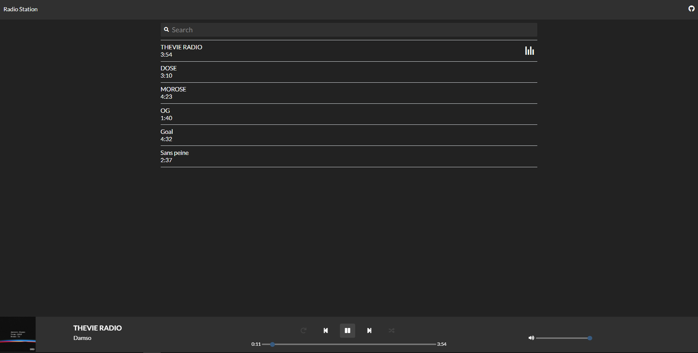
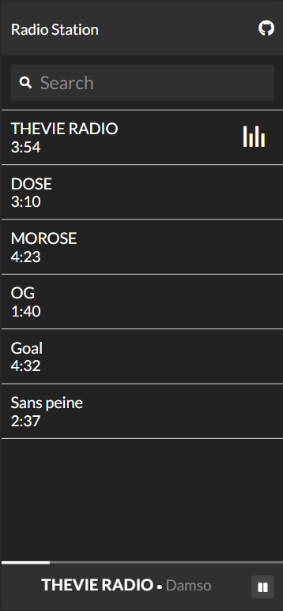
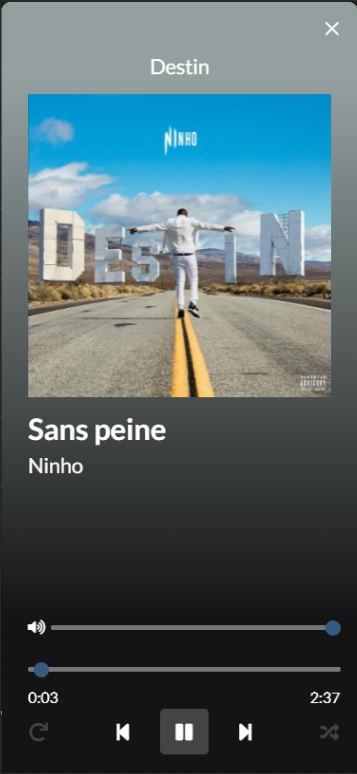

<!-- PROJECT SHIELDS -->
[![Contributors][contributors-shield]][contributors-url]
[![Forks][forks-shield]][forks-url]
[![Stargazers][stars-shield]][stars-url]
[![Issues][issues-shield]][issues-url]
[![GNU License][license-shield]][license-url]

<!-- PROJECT LOGO -->
 

  

  <h3 align="center">VLC Web Interface</h3>

  

    A custom VLC web interface
     
    <a href="https://github.com/Daniel-Mendes/vlc-web-interface/issues">Report Bug</a>
    ·
    <a href="https://github.com/Daniel-Mendes/vlc-web-interface/issues">Request Feature</a>
  

<!-- ABOUT THE PROJECT -->
## About The Project

A custom VLC web interface

### Built With

* [Bootswatch](https://bootswatch.com/)
* [JQuery](https://jquery.com)
* [Font Awesome](https://fontawesome.com/)
* [downupPopup.js](https://downuppopupjs.dincerali.com/)
* [Color Thief](https://lokeshdhakar.com/projects/color-thief/)

<!-- GETTING STARTED -->
## Getting Started

### Installation

1. Locate the folder of the default VLC web interface (in my case it's /usr/share/vlc/lua/http/)

2. Back it up and replace the files with these ones (you can keep requests/ folder)

3. Enable the VLC web interface as described here: https://wiki.videolan.org/Documentation:Modules/http_intf

4. Start VLC, put some songs in the playlist and go to http://localhost:[CHOSEN PORT]

5. After entering your chosen password (look at the link for help), you will be greeted with the VLC web interface

<!-- USAGE EXAMPLES -->
## Usage

### On desktop

    

### On mobile

  
  

<!-- ROADMAP -->
## Roadmap

See the [open issues](https://github.com/Daniel-Mendes/vlc-web-interface/issues) for a list of proposed features (and known issues).

<!-- CONTRIBUTING -->
## Contributing

Contributions are what make the open source community such an amazing place to be learn, inspire, and create. Any contributions you make are **greatly appreciated**.

1. Fork the Project
2. Create your Feature Branch (`git checkout -b feature/AmazingFeature`)
3. Commit your Changes (`git commit -m 'Add some AmazingFeature'`)
4. Push to the Branch (`git push origin feature/AmazingFeature`)
5. Open a Pull Request

<!-- LICENSE -->
## License

Distributed under the GNU GPL 3.0 License. See `LICENSE` for more information.

<!-- CONTACT -->
## Contact

Daniel Mendes - [daniel-mendes.ch](https://www.daniel-mendes.ch/) - contact@daniel-mendes.ch

Project Link: [https://github.com/Daniel-Mendes/vlc-web-interface](https://github.com/Daniel-Mendes/vlc-web-interface)

<!-- MARKDOWN LINKS & IMAGES -->
<!-- https://www.markdownguide.org/basic-syntax/#reference-style-links -->
[contributors-shield]: https://img.shields.io/github/contributors/Daniel-Mendes/vlc-web-interface?style=for-the-badge
[contributors-url]: https://github.com/Daniel-Mendes/vlc-web-interface/graphs/contributors
[forks-shield]: https://img.shields.io/github/forks/Daniel-Mendes/vlc-web-interface?style=for-the-badge
[forks-url]: https://github.com/Daniel-Mendes/vlc-web-interface/network/members
[stars-shield]: https://img.shields.io/github/stars/Daniel-Mendes/vlc-web-interface?style=for-the-badge
[stars-url]: https://github.com/Daniel-Mendes/vlc-web-interface/stargazers
[issues-shield]:https://img.shields.io/github/issues/Daniel-Mendes/vlc-web-interface?style=for-the-badge
[issues-url]: https://github.com/Daniel-Mendes/vlc-web-interface/issues
[license-shield]: https://img.shields.io/github/license/Daniel-Mendes/vlc-web-interface?style=for-the-badge
[license-url]: https://github.com/Daniel-Mendes/vlc-web-interface/blob/main/LICENSE
[product-screenshot]: ./example-desktop.png

https://img.shields.io/github/issues/Daniel-Mendes/vlc-web-interface?style=for-the-badge
